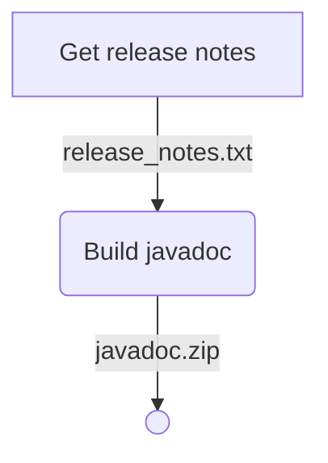
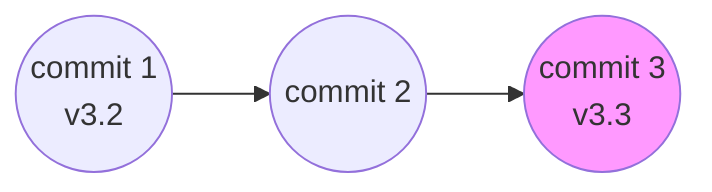
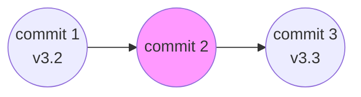

# Teamcity Kotlin DSL example

## How to setup

1. Use: `docker-compose up -d` command.
2. The token is printed in the server console and `teamcity-server-logs/teamcity-server.log`
3. After creating a user, visit ["Agents -> Unauthorized"](http://localhost:8112/agents.html?tab=unauthorizedAgents) to authorize the build agent.
4. Go to [versioned settings](http://localhost:8112/admin/editProject.html?projectId=_Root&tab=versionedSettings) check Synchronization enabled with settings format: kotlin and click "Apply" and "Import settings from VCS". It will run synchronization projects settings from GitHub. Wait when the status bar shows: "Changes from VCS are applied to project settings..."
5. Go to the job [Generate Documentation](http://localhost:8112/buildConfiguration/WhatsappBusinessJavaApi_Build?mode=builds#all-projects) and click Run.
6. The integration with github pull requests required to get [Github Api Token](https://github.com/settings/tokens) with **commit status** permission.

## How to run

1. You can run build with a specific commit hash. To do this, initiate the build with parameters, go to the "Changes" tab, select "Manual specific revision" under "Include changes," and paste the required commit hash into the "Revision" column.

## How it works.

Проект для сборки был выбран [whatsup-buisness-java-api](https://github.com/Bindambc/whatsapp-business-java-api) - рабочий форк для данного примера: [здесь](https://github.com/Nov1kov/javadoc-example)

### Project structure

- **.teamcity** - папка с Kotlin DSL скриптами.
- **teamcity-agent-conf** - папка с конфигами для агента teamcity.
- **teamcity-server-data** - папка с преднастроенными джобами в teamcity.
- **teamcity-server-logs** - здесь будут логи от teamcity server.
- **marketing-website** - nginx сервер с заготовленными данными.

### Job build documentation

### Choosing release notes

Версия для release notes берется из самого последнего известного тага для данного коммита.

В случае самого последнего **commit 3**, берется текущая версия **v3.3**

В случае **commit 2** последнего коммита будет версия **v3.2**

